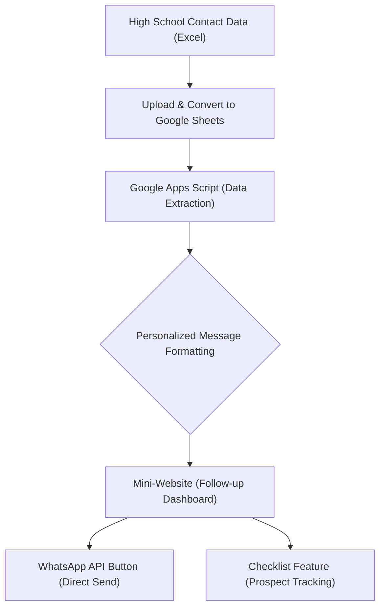

## 1. Background (Problem)
The campus marketing team routinely provides a database containing hundreds of high school student contacts in Excel format. Previously, the promotion staff had to process this data and follow up manually one by one via WhatsApp. This process was highly repetitive, time-consuming, and prone to *human error* (such as typos in names or incorrect message formats).

## 2. Technical Solution
To automate this process, I designed and implemented a *mini-website* for automated *follow-up*, integrated directly with **Google Sheets** and the **WhatsApp API**.

### System Workflow (Flowchart)
Here is a visualization of how data moves through the system I developed:



### Implementation
- **Automated Conversion:** The Excel file from marketing is quickly converted into a Google Spreadsheet.
- **Structured Data Extraction:** Google Apps Script runs in the background to pull specific data cells, namely the students' names and phone numbers.
- **Message Personalization:** The system instantly formats this data into a WhatsApp text *template* (replacing name variables with the student's actual name).
- **Operational Interface (Mini-Website):** This simple *web* interface provides:
  - A WhatsApp Web button that opens a *chat* with the automatically typed message.
  - An interactive *checklist* system to mark which prospects have been contacted and which have not.

### Code Snippet
Here is a snippet of the Google Apps Script code to automatically generate the *template* messages:

```javascript
function generateWhatsAppLink(sheetName) {
  var sheet = SpreadsheetApp.getActiveSpreadsheet().getSheetByName(sheetName);
  var data = sheet.getDataRange().getValues();
  var links = [];
  
  // Skip the first row (header)
  for (var i = 1; i < data.length; i++) {
    var nama = data[i][0]; // Column A: Name
    var nomorHP = data[i][1]; // Column B: Phone Number
    
    if (nama && nomorHP) {
      // Format phone number (remove leading 0 and replace with 62)
      var formattedPhone = "62" + nomorHP.toString().replace(/^0/, '');
      
      // Personalized message template
      var pesan = "Halo " + nama + ", kami dari Tim Promosi Satu University ingin mengundangmu ke acara Open House minggu depan!";
      
      // Encode URL for WhatsApp API
      var urlPesan = encodeURIComponent(pesan);
      var waLink = "https://wa.me/" + formattedPhone + "?text=" + urlPesan;
      
      links.push(waLink);
    }
  }
  return links;
}
```

## 3. Impact
This automation system significantly cut down the team's operational time. What used to take hours of typing messages one by one can now be executed instantly with just a few clicks. 

In a single *campaign*, the outreach process for approximately 100 students became much faster, more efficient, and the error rate for typos in names or contact numbers was reduced to near zero.

## 4. Satu University Instagram Promotion Team Content
Here are some of the promotional contents on Instagram that I participated in:

<div className="grid grid-cols-1 md:grid-cols-2 lg:grid-cols-3 gap-6 my-8">
  <blockquote className="instagram-media" data-instgrm-permalink="https://www.instagram.com/reel/DX9g0YSPlbI/?utm_source=ig_embed&amp;utm_campaign=loading" data-instgrm-version="14" style={{ background:'#FFF', border:0, borderRadius:'3px', boxShadow:'0 0 1px 0 rgba(0,0,0,0.5),0 1px 10px 0 rgba(0,0,0,0.15)', margin: '1px', maxWidth:'540px', minWidth:'326px', padding:0, width:'99.375%' }}></blockquote>
  <blockquote className="instagram-media" data-instgrm-permalink="https://www.instagram.com/reel/DXy0TtBPbmr/?utm_source=ig_embed&amp;utm_campaign=loading" data-instgrm-version="14" style={{ background:'#FFF', border:0, borderRadius:'3px', boxShadow:'0 0 1px 0 rgba(0,0,0,0.5),0 1px 10px 0 rgba(0,0,0,0.15)', margin: '1px', maxWidth:'540px', minWidth:'326px', padding:0, width:'99.375%' }}></blockquote>
  <blockquote className="instagram-media" data-instgrm-permalink="https://www.instagram.com/reel/DXrMBUIj4ob/?utm_source=ig_embed&amp;utm_campaign=loading" data-instgrm-version="14" style={{ background:'#FFF', border:0, borderRadius:'3px', boxShadow:'0 0 1px 0 rgba(0,0,0,0.5),0 1px 10px 0 rgba(0,0,0,0.15)', margin: '1px', maxWidth:'540px', minWidth:'326px', padding:0, width:'99.375%' }}></blockquote>
  <blockquote className="instagram-media" data-instgrm-permalink="https://www.instagram.com/reel/DYHqIcZP5vE/?utm_source=ig_embed&amp;utm_campaign=loading" data-instgrm-version="14" style={{ background:'#FFF', border:0, borderRadius:'3px', boxShadow:'0 0 1px 0 rgba(0,0,0,0.5),0 1px 10px 0 rgba(0,0,0,0.15)', margin: '1px', maxWidth:'540px', minWidth:'326px', padding:0, width:'99.375%' }}></blockquote>
  <blockquote className="instagram-media" data-instgrm-permalink="https://www.instagram.com/reel/DYE-4zdPNdq/?utm_source=ig_embed&amp;utm_campaign=loading" data-instgrm-version="14" style={{ background:'#FFF', border:0, borderRadius:'3px', boxShadow:'0 0 1px 0 rgba(0,0,0,0.5),0 1px 10px 0 rgba(0,0,0,0.15)', margin: '1px', maxWidth:'540px', minWidth:'326px', padding:0, width:'99.375%' }}></blockquote>
  <blockquote className="instagram-media" data-instgrm-permalink="https://www.instagram.com/reel/DX_-pIrP6by/?utm_source=ig_embed&amp;utm_campaign=loading" data-instgrm-version="14" style={{ background:'#FFF', border:0, borderRadius:'3px', boxShadow:'0 0 1px 0 rgba(0,0,0,0.5),0 1px 10px 0 rgba(0,0,0,0.15)', margin: '1px', maxWidth:'540px', minWidth:'326px', padding:0, width:'99.375%' }}></blockquote>
  <blockquote className="instagram-media" data-instgrm-permalink="https://www.instagram.com/reel/DXjkY2ej120/?utm_source=ig_embed&amp;utm_campaign=loading" data-instgrm-version="14" style={{ background:'#FFF', border:0, borderRadius:'3px', boxShadow:'0 0 1px 0 rgba(0,0,0,0.5),0 1px 10px 0 rgba(0,0,0,0.15)', margin: '1px', maxWidth:'540px', minWidth:'326px', padding:0, width:'99.375%' }}></blockquote>
  <blockquote className="instagram-media" data-instgrm-permalink="https://www.instagram.com/reel/DXeNkdxj-Oc/?utm_source=ig_embed&amp;utm_campaign=loading" data-instgrm-version="14" style={{ background:'#FFF', border:0, borderRadius:'3px', boxShadow:'0 0 1px 0 rgba(0,0,0,0.5),0 1px 10px 0 rgba(0,0,0,0.15)', margin: '1px', maxWidth:'540px', minWidth:'326px', padding:0, width:'99.375%' }}></blockquote>
  <blockquote className="instagram-media" data-instgrm-permalink="https://www.instagram.com/reel/DXZRxc8jwdq/?utm_source=ig_embed&amp;utm_campaign=loading" data-instgrm-version="14" style={{ background:'#FFF', border:0, borderRadius:'3px', boxShadow:'0 0 1px 0 rgba(0,0,0,0.5),0 1px 10px 0 rgba(0,0,0,0.15)', margin: '1px', maxWidth:'540px', minWidth:'326px', padding:0, width:'99.375%' }}></blockquote>
  <blockquote className="instagram-media" data-instgrm-permalink="https://www.instagram.com/reel/DXPE5b4j3Cz/?utm_source=ig_embed&amp;utm_campaign=loading" data-instgrm-version="14" style={{ background:'#FFF', border:0, borderRadius:'3px', boxShadow:'0 0 1px 0 rgba(0,0,0,0.5),0 1px 10px 0 rgba(0,0,0,0.15)', margin: '1px', maxWidth:'540px', minWidth:'326px', padding:0, width:'99.375%' }}></blockquote>
  <blockquote className="instagram-media" data-instgrm-permalink="https://www.instagram.com/reel/DXEeNNLj6Ka/?utm_source=ig_embed&amp;utm_campaign=loading" data-instgrm-version="14" style={{ background:'#FFF', border:0, borderRadius:'3px', boxShadow:'0 0 1px 0 rgba(0,0,0,0.5),0 1px 10px 0 rgba(0,0,0,0.15)', margin: '1px', maxWidth:'540px', minWidth:'326px', padding:0, width:'99.375%' }}></blockquote>
  <blockquote className="instagram-media" data-instgrm-permalink="https://www.instagram.com/reel/DXCDfLsD9bJ/?utm_source=ig_embed&amp;utm_campaign=loading" data-instgrm-version="14" style={{ background:'#FFF', border:0, borderRadius:'3px', boxShadow:'0 0 1px 0 rgba(0,0,0,0.5),0 1px 10px 0 rgba(0,0,0,0.15)', margin: '1px', maxWidth:'540px', minWidth:'326px', padding:0, width:'99.375%' }}></blockquote>
  <blockquote className="instagram-media" data-instgrm-permalink="https://www.instagram.com/reel/DW8935yD5Km/?utm_source=ig_embed&amp;utm_campaign=loading" data-instgrm-version="14" style={{ background:'#FFF', border:0, borderRadius:'3px', boxShadow:'0 0 1px 0 rgba(0,0,0,0.5),0 1px 10px 0 rgba(0,0,0,0.15)', margin: '1px', maxWidth:'540px', minWidth:'326px', padding:0, width:'99.375%' }}></blockquote>
</div>
