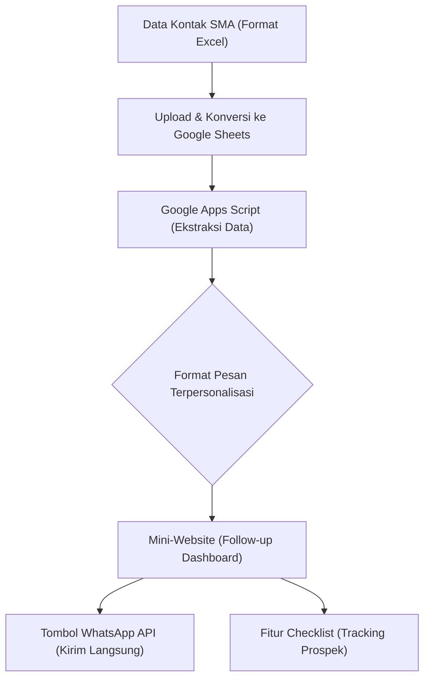

## 1. Latar Belakang (Problem)
Tim marketing kampus secara rutin memberikan basis data berisi ratusan kontak siswa SMA dalam format Excel. Sebelumnya, staf promosi harus memproses data ini dan melakukan proses *follow-up* secara manual satu per satu via WhatsApp. Proses ini sangat repetitif, memakan waktu lama, dan rentan terhadap *human error* (seperti salah ketik nama atau salah kirim format pesan).

## 2. Solusi Teknis
Untuk mengotomatisasi proses ini, saya merancang dan mengimplementasikan sebuah *mini-website* otomatisasi *follow-up* yang diintegrasikan langsung dengan **Google Sheets** dan **WhatsApp API**.

### Alur Kerja Sistem (Flowchart)
Berikut adalah visualisasi bagaimana data bergerak dalam sistem yang saya kembangkan:



### Implementasi
- **Konversi Otomatis:** File Excel dari marketing dikonversi secara cepat ke Google Spreadsheet.
- **Ekstraksi Data Terstruktur:** Google Apps Script berjalan di latar belakang untuk menarik sel data spesifik, yaitu nama dan nomor telepon siswa.
- **Personalisasi Pesan:** Sistem secara instan memformat data tersebut ke dalam *template* teks WhatsApp (mengganti variabel nama dengan nama asli siswa).
- **Antarmuka Operasional (Mini-Website):** Tampilan *web* sederhana ini menyediakan:
  - Tombol WhatsApp Web yang akan membuka *chat* dengan pesan yang sudah diketik otomatis.
  - Sistem *checklist* interaktif untuk menandai prospek mana yang sudah dihubungi dan mana yang belum.

### Cuplikan Kode (Code Snippet)
Berikut adalah potongan kode Google Apps Script untuk menghasilkan pesan *template* secara otomatis:

```javascript
function generateWhatsAppLink(sheetName) {
  var sheet = SpreadsheetApp.getActiveSpreadsheet().getSheetByName(sheetName);
  var data = sheet.getDataRange().getValues();
  var links = [];
  
  // Melewati baris pertama (header)
  for (var i = 1; i < data.length; i++) {
    var nama = data[i][0]; // Kolom A: Nama
    var nomorHP = data[i][1]; // Kolom B: Nomor HP
    
    if (nama && nomorHP) {
      // Memformat nomor telepon (menghilangkan awalan 0 dan mengganti dengan 62)
      var formattedPhone = "62" + nomorHP.toString().replace(/^0/, '');
      
      // Template pesan terpersonalisasi
      var pesan = "Halo " + nama + ", kami dari Tim Promosi Satu University ingin mengundangmu ke acara Open House minggu depan!";
      
      // Encode URL untuk WhatsApp API
      var urlPesan = encodeURIComponent(pesan);
      var waLink = "https://wa.me/" + formattedPhone + "?text=" + urlPesan;
      
      links.push(waLink);
    }
  }
  return links;
}
```

## 3. Dampak (Impact)
Sistem otomasi ini secara signifikan memangkas waktu operasional tim. Apa yang sebelumnya membutuhkan waktu berjam-jam untuk mengetik pesan satu per satu, kini dapat dieksekusi secara instan dengan beberapa klik saja. 

Dalam sekali *campaign*, proses penjangkauan terhadap kurang lebih 100 siswa menjadi jauh lebih cepat, efisien, dan tingkat kesalahan pengetikan nama atau nomor kontak berhasil ditekan mendekati nol.

## 4. Tim Promosi Konten Instagram Satu University
Berikut adalah beberapa konten promosi di Instagram yang saya ikuti:

<div className="grid grid-cols-1 md:grid-cols-2 lg:grid-cols-3 gap-6 my-8">
  <blockquote className="instagram-media" data-instgrm-permalink="https://www.instagram.com/reel/DX9g0YSPlbI/?utm_source=ig_embed&amp;utm_campaign=loading" data-instgrm-version="14" style={{ background:'#FFF', border:0, borderRadius:'3px', boxShadow:'0 0 1px 0 rgba(0,0,0,0.5),0 1px 10px 0 rgba(0,0,0,0.15)', margin: '1px', maxWidth:'540px', minWidth:'326px', padding:0, width:'99.375%' }}></blockquote>
  <blockquote className="instagram-media" data-instgrm-permalink="https://www.instagram.com/reel/DXy0TtBPbmr/?utm_source=ig_embed&amp;utm_campaign=loading" data-instgrm-version="14" style={{ background:'#FFF', border:0, borderRadius:'3px', boxShadow:'0 0 1px 0 rgba(0,0,0,0.5),0 1px 10px 0 rgba(0,0,0,0.15)', margin: '1px', maxWidth:'540px', minWidth:'326px', padding:0, width:'99.375%' }}></blockquote>
  <blockquote className="instagram-media" data-instgrm-permalink="https://www.instagram.com/reel/DXrMBUIj4ob/?utm_source=ig_embed&amp;utm_campaign=loading" data-instgrm-version="14" style={{ background:'#FFF', border:0, borderRadius:'3px', boxShadow:'0 0 1px 0 rgba(0,0,0,0.5),0 1px 10px 0 rgba(0,0,0,0.15)', margin: '1px', maxWidth:'540px', minWidth:'326px', padding:0, width:'99.375%' }}></blockquote>
  <blockquote className="instagram-media" data-instgrm-permalink="https://www.instagram.com/reel/DYHqIcZP5vE/?utm_source=ig_embed&amp;utm_campaign=loading" data-instgrm-version="14" style={{ background:'#FFF', border:0, borderRadius:'3px', boxShadow:'0 0 1px 0 rgba(0,0,0,0.5),0 1px 10px 0 rgba(0,0,0,0.15)', margin: '1px', maxWidth:'540px', minWidth:'326px', padding:0, width:'99.375%' }}></blockquote>
  <blockquote className="instagram-media" data-instgrm-permalink="https://www.instagram.com/reel/DYE-4zdPNdq/?utm_source=ig_embed&amp;utm_campaign=loading" data-instgrm-version="14" style={{ background:'#FFF', border:0, borderRadius:'3px', boxShadow:'0 0 1px 0 rgba(0,0,0,0.5),0 1px 10px 0 rgba(0,0,0,0.15)', margin: '1px', maxWidth:'540px', minWidth:'326px', padding:0, width:'99.375%' }}></blockquote>
  <blockquote className="instagram-media" data-instgrm-permalink="https://www.instagram.com/reel/DX_-pIrP6by/?utm_source=ig_embed&amp;utm_campaign=loading" data-instgrm-version="14" style={{ background:'#FFF', border:0, borderRadius:'3px', boxShadow:'0 0 1px 0 rgba(0,0,0,0.5),0 1px 10px 0 rgba(0,0,0,0.15)', margin: '1px', maxWidth:'540px', minWidth:'326px', padding:0, width:'99.375%' }}></blockquote>
  <blockquote className="instagram-media" data-instgrm-permalink="https://www.instagram.com/reel/DXjkY2ej120/?utm_source=ig_embed&amp;utm_campaign=loading" data-instgrm-version="14" style={{ background:'#FFF', border:0, borderRadius:'3px', boxShadow:'0 0 1px 0 rgba(0,0,0,0.5),0 1px 10px 0 rgba(0,0,0,0.15)', margin: '1px', maxWidth:'540px', minWidth:'326px', padding:0, width:'99.375%' }}></blockquote>
  <blockquote className="instagram-media" data-instgrm-permalink="https://www.instagram.com/reel/DXeNkdxj-Oc/?utm_source=ig_embed&amp;utm_campaign=loading" data-instgrm-version="14" style={{ background:'#FFF', border:0, borderRadius:'3px', boxShadow:'0 0 1px 0 rgba(0,0,0,0.5),0 1px 10px 0 rgba(0,0,0,0.15)', margin: '1px', maxWidth:'540px', minWidth:'326px', padding:0, width:'99.375%' }}></blockquote>
  <blockquote className="instagram-media" data-instgrm-permalink="https://www.instagram.com/reel/DXZRxc8jwdq/?utm_source=ig_embed&amp;utm_campaign=loading" data-instgrm-version="14" style={{ background:'#FFF', border:0, borderRadius:'3px', boxShadow:'0 0 1px 0 rgba(0,0,0,0.5),0 1px 10px 0 rgba(0,0,0,0.15)', margin: '1px', maxWidth:'540px', minWidth:'326px', padding:0, width:'99.375%' }}></blockquote>
  <blockquote className="instagram-media" data-instgrm-permalink="https://www.instagram.com/reel/DXPE5b4j3Cz/?utm_source=ig_embed&amp;utm_campaign=loading" data-instgrm-version="14" style={{ background:'#FFF', border:0, borderRadius:'3px', boxShadow:'0 0 1px 0 rgba(0,0,0,0.5),0 1px 10px 0 rgba(0,0,0,0.15)', margin: '1px', maxWidth:'540px', minWidth:'326px', padding:0, width:'99.375%' }}></blockquote>
  <blockquote className="instagram-media" data-instgrm-permalink="https://www.instagram.com/reel/DXEeNNLj6Ka/?utm_source=ig_embed&amp;utm_campaign=loading" data-instgrm-version="14" style={{ background:'#FFF', border:0, borderRadius:'3px', boxShadow:'0 0 1px 0 rgba(0,0,0,0.5),0 1px 10px 0 rgba(0,0,0,0.15)', margin: '1px', maxWidth:'540px', minWidth:'326px', padding:0, width:'99.375%' }}></blockquote>
  <blockquote className="instagram-media" data-instgrm-permalink="https://www.instagram.com/reel/DXCDfLsD9bJ/?utm_source=ig_embed&amp;utm_campaign=loading" data-instgrm-version="14" style={{ background:'#FFF', border:0, borderRadius:'3px', boxShadow:'0 0 1px 0 rgba(0,0,0,0.5),0 1px 10px 0 rgba(0,0,0,0.15)', margin: '1px', maxWidth:'540px', minWidth:'326px', padding:0, width:'99.375%' }}></blockquote>
  <blockquote className="instagram-media" data-instgrm-permalink="https://www.instagram.com/reel/DW8935yD5Km/?utm_source=ig_embed&amp;utm_campaign=loading" data-instgrm-version="14" style={{ background:'#FFF', border:0, borderRadius:'3px', boxShadow:'0 0 1px 0 rgba(0,0,0,0.5),0 1px 10px 0 rgba(0,0,0,0.15)', margin: '1px', maxWidth:'540px', minWidth:'326px', padding:0, width:'99.375%' }}></blockquote>
</div>
